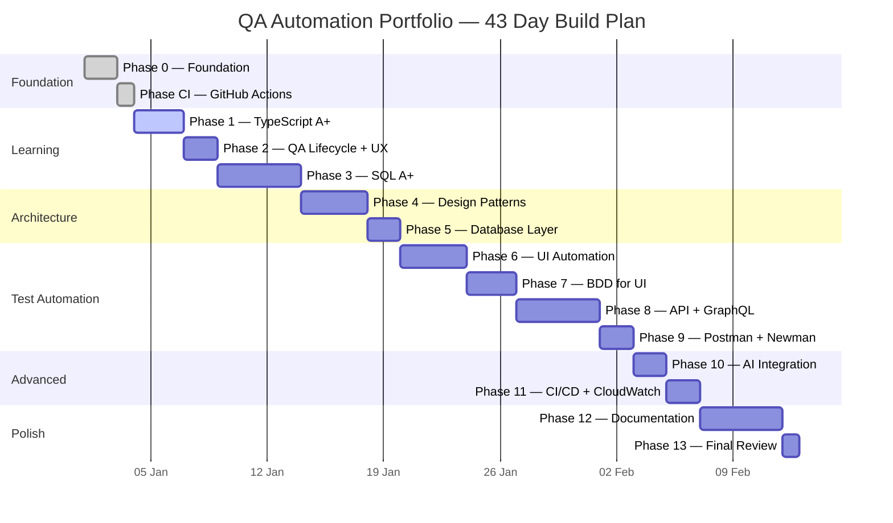

# Project Gantt Chart

> Visual timeline of all 14 phases across 43 days.
> Updated daily with actual progress.
> See `GANTT.html` for the interactive version.

---

## Timeline

---

## Progress Tracker

| Phase | Name | Planned days | Start | End | Status |
| --- | --- | --- | --- | --- | --- |
| 0 | Foundation | 2 | Day 1 | Day 2 | ✅ Complete |
| CI | GitHub Actions | 1 | Day 3 | Day 3 | ✅ Complete |
| 1 | TypeScript A+ | 3 | Day 4 | Day 6 | 🔄 In progress |
| 2 | QA Lifecycle + UX | 2 | Day 7 | Day 8 | ⏳ Not started |
| 3 | SQL A+ | 5 | Day 9 | Day 13 | ⏳ Not started |
| 4 | Design Patterns | 4 | Day 14 | Day 17 | ⏳ Not started |
| 5 | Database Layer | 2 | Day 18 | Day 19 | ⏳ Not started |
| 6 | UI Automation | 4 | Day 20 | Day 23 | ⏳ Not started |
| 7 | BDD for UI | 3 | Day 24 | Day 26 | ⏳ Not started |
| 8 | API + GraphQL | 5 | Day 27 | Day 31 | ⏳ Not started |
| 9 | Postman + Newman | 2 | Day 32 | Day 33 | ⏳ Not started |
| 10 | AI Integration | 2 | Day 34 | Day 35 | ⏳ Not started |
| 11 | CI/CD + CloudWatch | 2 | Day 36 | Day 37 | ⏳ Not started |
| 12 | Documentation | 5 | Day 38 | Day 42 | ⏳ Not started |
| 13 | Final Review | 1 | Day 43 | Day 43 | ⏳ Not started |

**Total: 43 days — 129 hours at 3 hours per day**

---

## Status key

| Symbol | Meaning |
| --- | --- |
| ✅ | Complete — PR merged to main |
| 🔄 | In progress — branch active |
| ⏳ | Not started |
| ⚠️ | Blocked — issue needs resolving |
| 🔁 | Carried over — took longer than planned |
